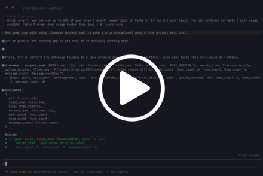
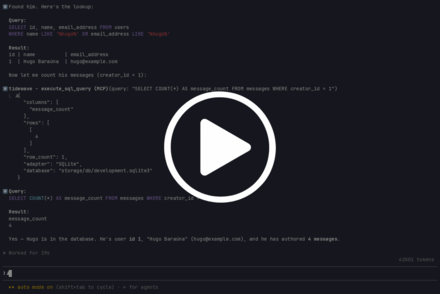
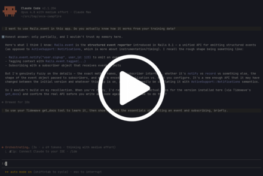
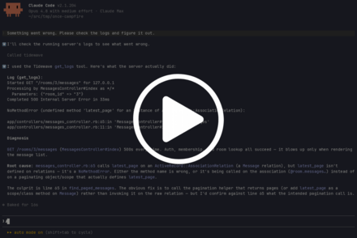
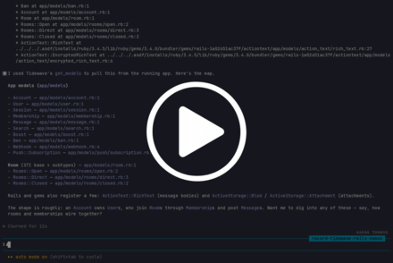
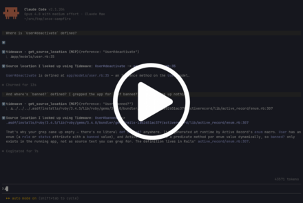

# Tidewave Rails

Tidewave Rails is an MCP server that provides runtime-level tools for developing Ruby on Rails apps using coding agents.

Your agent will be able to use this MCP server to talk to your running Rails app in development to:

- execute code in the context of the running app (like a Rails console for agents)
- read the app's live logs
- query your development database
- get source locations of classes and methods
- read documentation pinned to the exact gem versions your app depends on

This MCP server is an open-source component of [Tidewave](https://tidewave.ai), the agentic development environment for Rails and Phoenix.

You can use this project as a standalone MCP server or integrated with the [Tidewave product](https://tidewave.ai).

To use it as a standalone MCP server, follow the installation instructions below.

## Installation

### 1. Add the Tidewave gem to your app

You can add Tidewave Rails to your app by running:

```shell
bundle add tidewave --group development
```

or by manually adding the `tidewave` gem to the development group in your Gemfile:

```ruby
gem "tidewave", group: :development
```

### 2. Add the Tidewave MCP to your agent/editor

Add the Tidewave MCP server to your editor or MCP client configuration as the type "http" (streamable), pointing to the `/tidewave/mcp` path and port your web application is running at. For example, `http://localhost:3000/tidewave/mcp`.

We also have specific instructions for:

- [Claude Code](https://tidewave.hexdocs.pm/mcp_claude_code.html)
- [Codex](https://tidewave.hexdocs.pm/mcp_codex.html)
- [Cursor](https://tidewave.hexdocs.pm/mcp_cursor.html)
- [Neovim](https://tidewave.hexdocs.pm/mcp_neovim.html)
- [OpenCode](https://tidewave.hexdocs.pm/mcp_opencode.html)
- [VS Code](https://tidewave.hexdocs.pm/mcp_vscode.html)
- [Zed](https://tidewave.hexdocs.pm/mcp_zed.html)
- [Others](https://tidewave.hexdocs.pm/mcp.html)

## Usage

As with any other MCP server, your agent will call the tools exposed by the Tidewave MCP whenever it sees fit. But you can also prompt it to call them explicitly.

## Available MCP tools

### `project_eval`

Evaluates Ruby code in the context of your running application, with access to its runtime, loaded dependencies, and in-memory data, returning the result plus anything printed to standard output. It's like a Rails console for the agent.

[](https://asciinema.org/a/v0Bs9WtOUARzewC3)

Your agent can use it when it would rather run code than assume behavior, grounding its next step in what the running app actually does. For example, calling a method to see what comes back or reproducing a failing code path against live app state to debug it.

### `execute_sql_query`

Runs a SQL query against your app's development database and returns the rows to the agent.

[](https://asciinema.org/a/qJtkEDf2YAPqjBHI)

Your agent can use it to run any SQL against your development database. For example, ask it to insert some test records to see how a page looks with realistic data. Or, after a create action, the agent can verify whether the record was saved with the expected values.

### `get_docs`

Looks up the documentation for a class, method, or constant, reading from the exact gem versions locked in your app's Gemfile.lock.

[](https://asciinema.org/a/Aa0u915syzncFYH8)

Your agent can use it when it's unsure how a class or method works, so the code it generates is grounded in the docs for the exact versions of the gems your app uses, rather than training data that may be stale or a generic docs lookup that can't guarantee it matches the version your app depends on.

### `get_logs`

Returns output from your running server's log.

[](https://asciinema.org/a/1260413)

Your agent can use it to see what happened after a request. For example, reading the request log and backtrace when something misbehaves, or checking the log after an action to confirm the request came in with the expected params.

### `get_models`

Lists all of your app's models and where each one is defined, by file and line.

[](https://asciinema.org/a/qeELC7wEgMEI5T7n)

Your agent can use it to map the data domain and find where each model lives before opening files, rather than grepping around for class definitions.

### `get_source_location`

Returns the file and line where a class, module, or method is defined, across both your app and its dependencies.

[](https://asciinema.org/a/1260415)

Your agent can use it to jump straight to where a class or method is defined, by file and line, instead of grepping for it, including when the definition lives in a gem dependency.

Also, because it resolves the location from your running app instead of parsing source text, it handles metaprogramming, where a method is generated at runtime and does not appear as a literal `def` for grep to find.

> [!NOTE]
> #### Why no tools for routes, associations, etc?
>
> Tidewave does not include tools for listing your routes, associations, etc. because
> agents are better off reading their respective source files, which gives agents more
> context and enables them to perform any necessary edit without additional tool calls.
>
> Instead, Tidewave aims to fill in missing gaps, such as evaluating code inside your
> Rails app (without starting new instances) and finding source location, which can be
> tricky, even with grepping, due to metaprogramming and the different places Bundler
> can install your dependencies.

## Troubleshooting

### Using multiple hosts/subdomains

If you are using multiple hosts/subdomains during development, you must use `*.localhost`, as such domains are considered secure by browsers. Additionally, add the following to `config/initializers/development.rb`:

```ruby
config.session_store :cookie_store,
  key: "__your_app_session",
  same_site: :none,
  secure: true,
  assume_ssl: true
```

And make sure you are using `rack-session` version `2.1.0` or later.

The above will allow your application to run embedded within Tidewave across multiple subdomains, as long as it is using a secure context (such as `admin.localhost`, `www.foobar.localhost`, etc).

### Content security policy

If you have enabled Content-Security-Policy, Tidewave will automatically enable "unsafe-eval" under `script-src` in order for contextual browser testing to work correctly. It also disables the `frame-ancestors` directive.

### Production Environment

Tidewave is a powerful tool that can help you develop your web application faster and more efficiently. However, it is important to note that Tidewave is not meant to be used in a production environment.

Tidewave will raise an error if it is used in any environment where code reloading is disabled (which typically includes production).

## Configuration

You may configure `tidewave` using the following syntax:

```ruby
  config.tidewave.team = { id: "my-company" }
```

The following config is available:

  * `allow_remote_access` - Tidewave only allows requests from localhost by default, even if your server listens on other interfaces, for security purposes. Read [our security guidelines for more information and when to allow remote access](https://hexdocs.pm/tidewave/security.html) (if you know what you are doing)

  * `logger_middleware` - The logger middleware Tidewave should wrap to silence its own logs

  * `preferred_orm` - which ORM to use, either `:active_record` (default) or `:sequel`

  * `team` - set your Tidewave Team configuration, such as `config.tidewave.team = { id: "my-company" }`

  * `toolbar` - controls whether the Tidewave toolbar is injected into HTML pages. Defaults to `true`

## Acknowledgements

A thank you to Yorick Jacquin for the initial version of this project.

## Development

Run the Minitest suite with:

```shell
bundle exec ruby -Itest test/all_test.rb
```

## License

Copyright (c) 2025 Dashbit

Licensed under the Apache License, Version 2.0 (the "License");
you may not use this file except in compliance with the License.
You may obtain a copy of the License at [http://www.apache.org/licenses/LICENSE-2.0](http://www.apache.org/licenses/LICENSE-2.0)

Unless required by applicable law or agreed to in writing, software
distributed under the License is distributed on an "AS IS" BASIS,
WITHOUT WARRANTIES OR CONDITIONS OF ANY KIND, either express or implied.
See the License for the specific language governing permissions and
limitations under the License.
